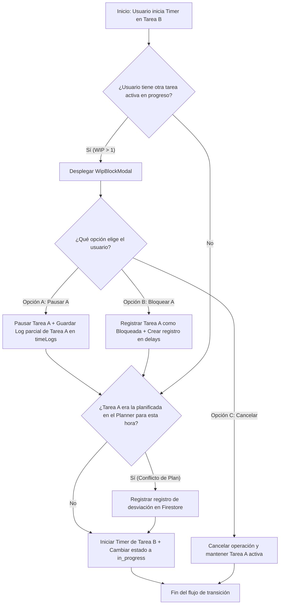

# Reporte de Análisis Conceptual: Integración de Seguimiento de Tiempo (Time Tracking)
**Plataforma:** AutoBOM Pro — Engineering Management Platform  
**Autor:** Especialista de Implementación (teamwork_preview_worker)  
**Fecha:** 16 de Junio de 2026  
**Estado:** Propuesta de Diseño Conceptual  

---

## Introducción

En la transición de AutoBOM Pro de un gestor de listas de materiales (BOM) a una **Plataforma Integral de Gestión de Ingeniería (Engineering Management Platform)**, la medición exacta y el registro de tiempos dedicados a las actividades se vuelven pilares fundamentales. Este módulo no solo permite justificar costes de ingeniería ante clientes externos, sino que también alimenta directamente el motor de **Individual Performance Score (IPS)** y provee datos al panel de control **Obeya** para la toma de decisiones estratégicas.

El mayor desafío técnico y cultural del seguimiento de tiempo es equilibrar la precisión de los datos con la carga administrativa sobre el equipo técnico. Este análisis aborda la estrategia de integración, la gestión del cambio, el comportamiento técnico del motor de base de datos y la resolución de conflictos en el registro temporal, garantizando que el sistema sea un habilitador de productividad y no una herramienta de microgestion punitiva.

---

## 1. Matriz de Pros y Contras por Rol (R1)

Para garantizar la adopción exitosa del sistema, es necesario entender el impacto de la integración de Time Tracking desde la perspectiva de cada rol del departamento. A continuación, se detallan sus necesidades específicas, los pros de la integración, los contras o puntos de fricción, y las estrategias de mitigación correspondientes.

### 1.1 Manager / Directivo

| Dimensión | Detalle Analítico |
| :--- | :--- |
| **Necesidades Específicas** | • Visibilidad macro del costo de ingeniería y diseño por proyecto.<br>• Datos consolidados para la justificación de desviaciones presupuestarias ante la dirección.<br>• Indicadores confiables de rendimiento individual y del equipo (IPS).<br>• Capacidad para proyectar la carga de trabajo futura y planificar contrataciones. |
| **Pros de la Integración** | • **Datos objetivos y en tiempo real:** Eliminación de aproximaciones tardías basadas en memoria de fin de mes.<br>• **Reducción de reuniones de sincronización:** Los reportes diarios consolidados (`dailyReports`) automatizan el flujo de información.<br>• **Identificación temprana de riesgos:** Detección de sobrecargas de capacidad y riesgos de retraso en el Obeya. |
| **Contras / Fricción** | • **Calidad inicial del dato:** Riesgo de datos basura si el equipo técnico ingresa registros incoherentes.<br>• **Resistencia cultural:** El equipo puede percibir la métrica como un mecanismo de vigilancia o desconfianza por parte de la directiva.<br>• **Sobrecarga de alertas:** Recibir demasiadas notificaciones si no se ajustan los umbrales de desviación. |
| **Estrategia de Mitigación** | • Establecer el **Periodo de Gracia** (Fase 3) para estabilizar la entrada de datos antes de usarlos en evaluaciones.<br>• Comunicar de manera transparente el algoritmo del IPS, demostrando que valora la consistencia y no solo la velocidad.<br>• Configurar filtros inteligentes en el Control Tower para reportar solo anomalías críticas. |

### 1.2 Team Lead / Líder de Proyecto

| Dimensión | Detalle Analítico |
| :--- | :--- |
| **Necesidades Específicas** | • Planificación semanal ágil y asignación equilibrada de tareas.<br>• Control diario del estado de ejecución (Kanban).<br>• Aprobación rápida y contextualizada de horas extra (`overtimeHours`).<br>• Identificación y resolución ágil de bloqueos técnicos o dependencias externas. |
| **Pros de la Integración** | • **Sincronización bidireccional:** El Weekly Planner interactúa en tiempo real con las tareas Kanban.<br>• **Control de Horas Extra:** Las horas extra marcadas manualmente por el usuario se asocian de forma transparente al coste de la tarea.<br>• **Automatización de reportes:** Ahorro en la confección manual de reportes de estatus de proyectos para gerencia. |
| **Contras / Fricción** | • **Carga de gestión:** Tiempo dedicado a la resolución de conflictos de planificación (ej. desviaciones semanales).<br>• **Doble mantenimiento:** Riesgo de desalineación entre el Gantt del proyecto y la realidad del Planner si no están bien integrados.<br>• **Gestión de fricciones:** Lidiar con las alertas de inactividad o bloqueos WIP de los ingenieros a su cargo. |
| **Estrategia de Mitigación** | • Enlazar de forma nativa la actualización de fechas del Gantt y del Weekly Planner a través del servicio `ganttPlannerSync.js`.<br>• Proveer un panel de resolución de conflictos visual y rápido que sugiera acciones automáticas (ej. "Replanificar tarea").<br>• Automatizar la aprobación de horas extra si se cumplen ciertos parámetros preestablecidos de la tarea. |

### 1.3 Ingeniero / Técnico

| Dimensión | Detalle Analítico |
| :--- | :--- |
| **Necesidades Específicas** | • Claridad absoluta sobre las prioridades diarias sin interrupciones.<br>• Reportar su tiempo con el menor esfuerzo posible (mantener estado de "flow").<br>• Justificar retrasos causados por problemas técnicos, falta de materiales o decisiones externas. |
| **Pros de la Integración** | • **Reducción del 80% del llenado manual:** El temporizador automático basado en el Planner o Kanban minimiza la burocracia.<br>• **Evidencia de sobrecarga:** Datos duros para demostrar la saturación de tareas ante el Team Lead.<br>• **Foco atencional:** El temporizador activo sirve como incentivo visual de foco de tarea única. |
| **Contras / Fricción** | • **Sensación de microgestión:** Monitoreo constante del inicio/fin de actividades.<br>• **Interrupción por bloqueos WIP:** Fricción al intentar cambiar de actividad rápidamente si el sistema bloquea la acción.<br>• **Olvidos de control:** Olvidar encender o apagar el temporizador y arruinar el histórico temporal. |
| **Estrategia de Mitigación** | • **Jerarquía de prioridad empoderante:** La entrada manual del usuario siempre corrige y prevalece sobre cualquier automatización.<br>• **Modal interactivo no punitivo (`WipBlockModal`):** Permite resolver el conflicto de múltiples tareas con 2 clics (pausando o bloqueando la anterior con causas justificadas).<br>• **Deducción de inactividad inteligente:** Ventanas de tolerancia antes de pausar el temporizador por inactividad. |

---

## 2. Estrategia de Gestión del Cambio y Comunicación (R2)

Para asegurar la transición exitosa del equipo y erradicar los temores al control del tiempo, se define un plan de implantación estructurado en 5 fases. Este plan prioriza la transparencia, el empoderamiento del usuario y el aprendizaje continuo.

```
       [ Fase 1 ] ─────────► [ Fase 2 ] ─────────► [ Fase 3 ] ─────────► [ Fase 4 ] ─────────► [ Fase 5 ]
     Sensibilización      Prioridad de Entrada    Periodo de Gracia     Feedback Activo       Adopción Completa
   (Reducir carga 80%)    (Manual > Sugerencias)     (Sandbox IPS)     (Pulido de Timers)    (Uso Obligatorio)
```

### Fase 1: Sensibilización (Semanas 1 y 2)
* **Propósito:** Comunicar los beneficios colectivos e individuales de la automatización.
* **Mensaje Clave:** El sistema no nace para auditar cada minuto del ingeniero, sino para **reducir en un 80% la carga administrativa** de rellenar partes de horas a mano al final de la semana, además de justificar técnicamente la sobrecarga de trabajo y la necesidad de más personal en el departamento.
* **Acciones:**
  * Reuniones de kickoff grupales mostrando la interfaz "My Work" y explicando cómo el Weekly Planner pre-carga y automatiza el registro temporal diario de manera transparente.
  * Habilitar un canal de preguntas y respuestas abierto para resolver mitos sobre el "Gran Hermano".

### Fase 2: Priorización de Entrada (Semana 3)
* **Propósito:** Devolver el control al usuario final, eliminando la sensación de rigidez robótica.
* **Mensaje Clave:** **Tú tienes la última palabra.** La automatización es una ayuda, pero el usuario es el auditor supremo de sus datos.
* **Acciones:**
  * Capacitar en la jerarquía de prioridad del dato temporal:
    1. **Entrada Manual (Usuario):** Prevalece sobre todo. Modifica, crea o elimina cualquier bloque de tiempo.
    2. **Acción Kanban (Flujo):** Cambiar una tarea a `in_progress` sugiere o activa el temporizador automáticamente.
    3. **Planner (Programación semanal):** Se usa como estimación o respaldo en caso de ausencia de registros interactivos.
  * Demostración práctica de cómo ajustar registros manuales en la vista `WorkLogs`.

### Fase 3: Periodo de Gracia / Pruebas (Semanas 4 a 6)
* **Propósito:** Fomentar el uso experimental sin miedo a penalizaciones.
* **Mensaje Clave:** Las desviaciones, olvidos y re-planificaciones durante este periodo son parte del aprendizaje y **no afectarán bajo ningún concepto la evaluación de desempeño ni las métricas de IPS**.
* **Acciones:**
  * Ejecutar el sistema completo en modo "Sandbox" (Simulación). Las alertas en el Control Tower y en Obeya no generan notificaciones punitivas.
  * Realizar auditorías diarias internas de datos con fines únicamente informativos y de depuración.

### Fase 4: Retroalimentación Activa (Semanas 7 y 8)
* **Propósito:** Ajustar y personalizar el motor de tracking con la experiencia del equipo en campo.
* **Acciones:**
  * Reuniones de 15 minutos semanales para debatir la usabilidad del temporizador.
  * Encuestas cortas para definir la tolerancia del detector de inactividad (ej. ¿cuántos minutos de inactividad de teclado/ratón deben pasar antes de pausar el temporizador?).
  * Ajuste de la lista de causas de retraso del `WipBlockModal` para asegurar que resolver un bloqueo de WIP no tome más de 10 segundos del tiempo del ingeniero.

### Fase 5: Adopción Completa (Semana 9 en adelante)
* **Propósito:** Entrada en vigencia formal del sistema integrado.
* **Acciones:**
  * Activación formal del cálculo del IPS basado en la disciplina de datos y la exactitud de planificación.
  * Generación y envío diario automático de reportes a gerencia (.xlsx) con el rollup de horas reales vs. estimadas.
  * Uso regular de las alertas de desvío para la re-planificación ágil en las reuniones de los lunes.

---

## 3. Propuesta de Flujo de Trabajo Conceptual (R3)

Para soportar las necesidades de negocio y las fases de gestión del cambio detalladas anteriormente, se define el siguiente modelo técnico para el motor de sincronización.

### 3.1 Motor de Sincronización en Firestore

El sistema opera vinculando tres colecciones principales en Firestore mediante triggers reactivos y servicios del cliente:

```
                  ┌──────────────────────┐
                  │  weeklyPlanItems     │
                  │  (Bloques Planificados)
                  └──────────┬───────────┘
                             │
                             │ (Propagación / Referencia)
                             ▼
┌────────────────┐        ┌──┴─────────────┐
│  timeLogs      ├───────►│  tasks         │
│  (Logs Reales) │Rollup  │  (Acumula      │
└────────────────┘        │  actualHours)  │
                          └────────────────┘
```

#### Estructuras de Datos Relevantes (basadas en `schemas.js`):

1. **`weeklyPlanItems` (Planificador Semanal):**
   * Contiene la planificación diaria/horaria estimada de un ingeniero.
   * Campos clave: `taskId`, `assignedTo` (userId), `date` (YYYY-MM-DD), `startDateTime` e `endDateTime` (horario programado), `plannedHours` (número), `statusSnapshot` (estado de la tarea al planificar).

2. **`timeLogs` (Registros de Tiempo Real):**
   * Representa las sesiones reales de trabajo efectivo asociadas a una tarea.
   * Campos clave: `taskId`, `projectId`, `userId`, `startTime` (ISO), `endTime` (ISO), `totalHours` (horas netas calculadas), `overtime` (boolean), `overtimeHours` (número), `source` (`manual` | `planner_auto` | `kanban_auto` | `open_day`), `notes`.

3. **`tasks` (Tareas de Ingeniería):**
   * Agrupa la información de ejecución del trabajo.
   * Campos clave: `estimatedHours` (tiempo presupuestado), `actualHours` (rollup de `timeLogs`), `status` (`backlog`, `pending`, `in_progress`, `validation`, `completed`, `blocked`, `cancelled`), `blockedAt`, `totalBlockedHours`, `percentComplete`.

---

### 3.2 Eventos en Tiempo Real e Interacción de Temporizadores

El comportamiento del sistema responde en tiempo real a los eventos generados por el usuario y el planificador:

#### A. Cambio de Plan en Tiempo Real
Si un Team Lead altera el horario de una tarea programada en `weeklyPlanItems` mientras la semana está en curso, el sistema:
1. Recalcula de inmediato las horas planificadas asignadas al ingeniero para ese día.
2. Si el cambio se superpone con la tarea actualmente en ejecución, el frontend despliega una notificación flotante (Toast) sugiriendo el cambio de foco, pero sin forzarlo para no romper el estado de concentración (flow) del ingeniero.
3. Registra una desviación de planificación para el análisis de disciplina en el motor IPS si el ingeniero continúa en una tarea diferente a la planificada sin justificación.

#### B. Inicio de Temporizador Manual
Cuando el usuario inicia el temporizador manualmente en la vista "My Work":
1. El sistema realiza una consulta rápida a Firestore (`tasks` donde `assignedTo == userId` y `status == in_progress`) para verificar si ya existe otra tarea activa.
2. Si el límite de WIP (Work-in-Progress = 1 tarea activa simultánea) se cumple (0 tareas activas):
   * Crea un registro en `localStorage` con la marca de tiempo de inicio (`startTime`) para persistir ante cierres accidentales de navegador.
   * Actualiza el estado de la tarea en Firestore a `in_progress`.
3. Si ya existe una tarea activa en progreso:
   * **Se bloquea la acción** y se despliega el modal `WipBlockModal`.

#### C. Cambio a Estado `in_progress` en Kanban y Control WIP
Si el usuario arrastra una tarea a "En Progreso" en el tablero Kanban:
1. El sistema ejecuta el mismo control de límite de WIP de 1 tarea activa.
2. Si hay conflicto, se interrumpe la transición y se despliega el `WipBlockModal` para forzar al usuario a decidir sobre la tarea anterior antes de continuar.
3. Al resolver el modal (pausando o bloqueando la anterior), el motor realiza la transición de la nueva tarea a `in_progress` y arranca automáticamente el temporizador.

---

### 3.3 Cálculo de Horas Netas e Inactividad

El cálculo de horas reales en los `timeLogs` debe ser lo más fiel posible a la realidad laboral de la planta:

#### Deducción de Descansos e Inactividad:
1. **Deducción de Almuerzos/Descansos:** Si el temporizador se mantiene activo durante la ventana horaria configurada para el almuerzo (ej. 12:00 a 13:00), el sistema deduce automáticamente esa hora (60 minutos) de la duración neta del `timeLog` resultante, a menos que el usuario marque una casilla que indique "Trabajé durante el almuerzo" (justificado con una nota).
2. **Detección de Inactividad:** Si el cliente web detecta falta de interacción (movimiento de ratón, eventos de teclado) durante un umbral predefinido (ej. 15 minutos):
   * Se congela visualmente el acumulador de tiempo.
   * Se despliega un banner de alerta en pantalla.
   * Al regresar el usuario, este debe responder a la pregunta: *"¿Estuviste trabajando en esta tarea fuera de la PC?"*
     * Si responde **Sí:** El tiempo inactivo se valida y se suma al log.
     * Si responde **No:** El temporizador retrocede al minuto en que comenzó la inactividad, detiene el timer y crea el `timeLog` respectivo deduciendo la inactividad.

#### Rollup Acumulativo (`actualHours`):
Cada vez que un documento en `timeLogs` se crea, modifica o elimina:
1. Se dispara un trigger de Firestore que consulta la suma total de horas reales de todos los registros de tiempo de la tarea correspondiente:
   $$\text{actualHours} = \sum (\text{totalHours} \text{ de logs vinculados al taskId})$$
2. Se actualiza el campo `actualHours` en el documento de `tasks`.
3. Adicionalmente, se actualiza el campo `percentComplete` de la tarea si esta se rige por avance de horas, afectando en cascada el progreso del proyecto general (`projects.progress`).

---

## 4. Visuales y Mockups

Para facilitar el desarrollo del módulo por parte del equipo de frontend, se proveen los siguientes mockups conceptuales enriquecidos en formato ASCII.

### 4.1 Mockup 1: Línea de Tiempo Unificada (Unified Timeline)
Este componente se integra en la página "My Work" y permite comparar visualmente la planificación semanal frente al tiempo real de trabajo reportado, destacando desviaciones y tipos de registro.

```text
┌────────────────────────────────────────────────────────────────────────────────────────────────────────┐
│ 📅 LÍNEA DE TIEMPO UNIFICADA — VISTA DIARIA                                      [Semana Activa] [>]   │
├────────────────────────────────────────────────────────────────────────────────────────────────────────┤
│ Colaborador: Ing. Alejandro Ramos | Fecha: Martes, 16 de Junio de 2026                                 │
├────────────────────────────────────────────────────────────────────────────────────────────────────────┤
│ HORAS   │ 08:00    09:00    10:00    11:00    12:00    13:00    14:00    15:00    16:00    17:00       │
├─────────┼──────────────────────────────────────────────────────────────────────────────────────────────┤
│ PLAN    │ [======= TAREA-204: Diseño BOM =======] [ALM] [==== TAREA-205: Cableado PLC ====]            │
│ (Planner)│ (08:30 - 12:00)                          [UER] (13:00 - 17:00)                              │
├─────────┼──────────────────────────────────────────────────────────────────────────────────────────────┤
│ REAL    │ [═══════ G: En Progreso ══════][= N: Desv =][ R ]     [═══════ G: En Progreso ══════][══ A ══]│
│ (Track) │ (08:30 - 11:15)               (11:15-12:00) (ALM)     (13:00 - 16:00)          (16:00-17:00) │
├─────────┼──────────────────────────────────────────────────────────────────────────────────────────────┤
│ DETALLE │ • 08:30 - 11:15 : Trabajo efectivo registrado automáticamente en TAREA-204                   │
│ DE LOGS │ • 11:15 - 12:00 : Desviación (Inactividad/Pausa por reunión técnica no planificada)           │
│         │ • 12:00 - 13:00 : Almuerzo (Deducido de manera automática)                                   │
│         │ • 13:00 - 16:00 : Trabajo efectivo registrado en TAREA-205                                    │
│         │ • 16:00 - 17:00 : Registro Manual (Ajuste por soporte urgente en producción)                 │
├─────────┼──────────────────────────────────────────────────────────────────────────────────────────────┤
│ LEYENDA │ [ G ] Verde: Tiempo de Temporizador Activo / Efectivo                                        │
│         │ [ N ] Naranja: Desviación o Inactividad Deducida                                             │
│         │ [ R ] Rojo: Tiempo Bloqueado (Falta de material / Dependencia)                               │
│         │ [ A ] Azul: Entrada Temporal Manual / Modificación del Usuario                               │
└────────────────────────────────────────────────────────────────────────────────────────────────────────┘
```

---

### 4.2 Mockup 2: Panel de Control del Temporizador Activo (Active Timer Widget)
Este widget flotante y persistente acompaña al usuario durante su navegación por la plataforma, permitiendo el control ágil del tiempo de trabajo y la toma de notas en el flujo habitual.

```text
┌────────────────────────────────────────────────────────────────────────┐
│ ⏱️ TEMPORIZADOR DE TAREA ACTIVA                               [_] [X]   │
├────────────────────────────────────────────────────────────────────────┤
│ TAREA EN EJECUCIÓN:                                                    │
│ ┌────────────────────────────────────────────────────────────────────┐ │
│ │ [TAREA-205] Integración y Cableado de PLC Siemens S7-1200          │ │
│ └────────────────────────────────────────────────────────────────────┘ │
│ Proyecto: AutoBOM Pro - Celda Robotizada de Paletizado A               │
├────────────────────────────────────────────────────────────────────────┤
│ TIEMPO TRANSCURRIDO:                                                   │
│                                                                        │
│                       02 : 45 : 12                                     │
│                                                                        │
│ [⚡ HORAS EXTRA ACTIVO]  <- (Habilitado manualmente por el usuario)     │
├────────────────────────────────────────────────────────────────────────┤
│ NOTAS DE LA ACTIVIDAD (Para el Daily Report):                          │
│ ┌────────────────────────────────────────────────────────────────────┐ │
│ │ Ajustando el direccionamiento IP y probando entradas analógicas... │ │
│ └────────────────────────────────────────────────────────────────────┘ │
├────────────────────────────────────────────────────────────────────────┤
│ CONTROLES DEL TEMPORIZADOR:                                            │
│ ┌───────────────┐  ┌───────────────┐  ┌──────────────────────────────┐ │
│ │ ⏸️ PAUSAR TIMER │  │ 🛑 DETENER    │  │ 📝 GUARDAR Y COMPLETAR TAREA │ │
│ └───────────────┘  └───────────────┘  └──────────────────────────────┘ │
└────────────────────────────────────────────────────────────────────────┘
```

---

### 4.3 Mockup 3: WipBlockModal (Modal de Bloqueo de WIP)
Esta interfaz bloqueante se despliega en pantalla cuando un usuario intenta activar una segunda tarea (WIP > 1), garantizando la disciplina en la toma de tiempos e incitando a la resolución o documentación de las tareas pausadas.

```text
┌────────────────────────────────────────────────────────────────────────┐
│ ⚠️ ADVERTENCIA: LÍMITE DE TAREAS EN CURSO EXCEDIDO (LIMIT WIP)          │
├────────────────────────────────────────────────────────────────────────┤
│ El sistema permite únicamente una (1) tarea en progreso a la vez para  │
│ asegurar la consistencia del registro de tiempo y evitar el multitasking│
│ ineficiente.                                                           │
├────────────────────────────────────────────────────────────────────────┤
│ TAREA ACTUALMENTE ACTIVA:                                              │
│ • [TAREA-204] Diseño y Carga de BOM de Tableros Eléctricos             │
│ • Tiempo acumulado hoy: 03 horas y 15 minutos                          │
│ • Estado: EN PROGRESO (Timer Activo)                                   │
├────────────────────────────────────────────────────────────────────────┤
│ NUEVA TAREA A INICIAR:                                                 │
│ • [TAREA-205] Integración y Cableado de PLC Siemens S7-1200            │
├────────────────────────────────────────────────────────────────────────┤
│ SELECCIONE CÓMO DESEA PROCEDER CON LA TAREA ANTERIOR (TAREA-204):      │
│                                                                        │
│ [o] OPCIÓN A: Pausar tarea anterior y comenzar la nueva.               │
│     *El timer de TAREA-204 se detendrá y su estado pasará a "Pendiente"*│
│                                                                        │
│ [ ] OPCIÓN B: Bloquear tarea anterior y comenzar la nueva.             │
│     *El estado de TAREA-204 pasará a "Bloqueado". Indique los motivos:*│
│      Causa del Retraso: [ Material Faltante                      ][v] │
│      Comentarios:       [ Esperando bornas de Phoenix Contact    ]    │
│                                                                        │
│ [ ] OPCIÓN C: Cancelar acción.                                         │
│     *Regresa a la pantalla anterior sin realizar ningún cambio*        │
├────────────────────────────────────────────────────────────────────────┤
│                                  [ EXECUTAR TRANSICIÓN Y EMPEZAR TIMER ]│
└────────────────────────────────────────────────────────────────────────┘
```

---

### 4.4 Diagrama de Flujo: Resolución de Conflictos de Temporizador (Mermaid)

El siguiente diagrama detalla la lógica que ejecuta el sistema cuando un ingeniero inicia una tarea manual que entra en conflicto con lo planificado para esa franja horaria.



En este flujo de control, la acción deliberada del usuario (el inicio manual de la Tarea B) **toma precedencia absoluta** sobre la programación preestablecida en el planificador semanal. El sistema no impide que el ingeniero trabaje en algo diferente a lo planeado (lo cual es muy común en entornos dinámicos de ingeniería), pero se encarga de:
1. Asegurar que no existan dos timers activos simultáneamente (control WIP).
2. Documentar de forma automatizada por qué se abandonó la tarea anterior (pausa o retraso).
3. Registrar la desviación horaria en Firestore para alimentar los reportes analíticos de precisión de la planificación de cara a futuras iteraciones del Planner semanal.

---

## 5. Consideraciones de Seguridad y Robustez de Implementación (Mitigación de Riesgos)

Para garantizar la estabilidad operativa, la confiabilidad de las métricas de rendimiento y evitar manipulaciones o inconsistencias en los datos recolectados, la implementación del sistema de seguimiento de tiempo debe incorporar las siguientes medidas de mitigación de riesgos y seguridad a nivel de arquitectura:

### 5.1 Control de Inactividad y Heartbeat ante Cierres Abruptos
Para evitar que el temporizador de una tarea continúe corriendo de forma indefinida en el sistema en caso de que el usuario cierre el navegador de manera inesperada, apague el equipo o suspenda la máquina sin detener formalmente la actividad, se implementará un mecanismo dual de persistencia:
* **Heartbeat Local y Firestore:** El cliente enviará un "heartbeat" (latido de actividad) a Firestore o registrará localmente en `localStorage` cada 1-2 minutos de interacción activa.
* **Ajuste en la Recarga:** Al recargar la aplicación o iniciar una nueva sesión, el sistema comprobará si quedó una sesión abierta de forma anómala (sin marca de finalización formal). De ser así, utilizará la última marca de tiempo registrada por el heartbeat o `localStorage` para calcular el tiempo real de trabajo y cerrar el log abrupto, evitando la inflación artificial de horas acumuladas.

### 5.2 Optimización del Rollup de Horas (`actualHours`)
El cálculo recurrente del tiempo real invertido en las tareas puede generar una sobrecarga de lectura en Firestore si se realiza mediante consultas agregadas completas. Para optimizar el rendimiento y controlar los costes de la base de datos:
* **Incremento Neto Reactivo:** En lugar de ejecutar una sumatoria masiva de todos los documentos en `timeLogs` asociados a una tarea en cada cambio, el sistema utilizará operaciones nativas de incremento o decremento (como `FieldValue.increment()`) en el documento de la tarea correspondiente al momento de crear, modificar o eliminar registros de tiempo.
* **Eficiencia en Lecturas:** Esto reduce la operación a una única escritura atómica por modificación del log, permitiendo actualizaciones instantáneas de `actualHours` sin importar el tamaño del historial de la tarea.

### 5.3 Validación del Límite WIP Multidispositivo a Nivel de Base de Datos
Para asegurar la disciplina en el registro de tiempo y evitar que los usuarios eludan la restricción de WIP = 1 tarea activa mediante el uso de múltiples navegadores, pestañas o dispositivos simultáneos:
* **Documento de Control Único:** El estado de ejecución activo del usuario se centralizará en un documento específico dentro de Firestore (por ejemplo, `users/{userId}/activeTimer`).
* **Reglas de Seguridad y Transacciones:** Las reglas de seguridad de Firestore (`firestore.rules`) y las transacciones de escritura validarán que cualquier intento de iniciar un nuevo temporizador verifique primero el estado del documento `activeTimer`. Si este ya contiene un temporizador en curso, el servidor rechazará la escritura, obligando al cliente a resolver el conflicto (pausar o bloquear la tarea anterior) antes de permitir un nuevo registro.

### 5.4 Integridad de Modificaciones Retroactivas y Cierre de Periodos
Con el fin de evitar el fraude en la declaración de horas extra, asegurar la consistencia del IPS y dotar de integridad histórica al sistema:
* **Ventana de Bloqueo Semanal:** Se establecerá un límite estricto para la edición y creación de registros de tiempo pasados. Cada lunes a las 10:00 AM se bloqueará de forma automática la edición de cualquier registro de tiempo (`timeLogs`) perteneciente a la semana natural anterior.
* **Auditoría Inmutable:** Cualquier corrección manual retroactiva o justificación de tiempo fuera de la ventana permitida requerirá aprobación del Manager y quedará registrada de manera inmutable en la colección de logs de auditoría (`auditLogs`), incluyendo los detalles del valor anterior, el nuevo valor, la justificación del cambio y la identidad del autor de la edición.

---

## 6. Evaluación de Modelos y Diseño del Modelo Híbrido Asistido (Alternativa Elegida)

Para resolver el dilema entre la precisión del dato real y la baja fricción para el usuario (clave para superar la resistencia al cambio), se analizó el contraste entre un **Planner Unificado** y **Flujos Separados**, seleccionando el **Modelo Híbrido Asistido** como la solución ideal para AutoBOM Pro.

### 6.1 Cuadro Comparativo de Alternativas

| Característica | Opción A: Planner Unificado (Planner = Hoja de Horas) | Opción B: Flujos Separados (Planner vs. Temporizador) | Opción C (Elegida): Modelo Híbrido Asistido (Planner como Borrador de Horas) |
| :--- | :--- | :--- | :--- |
| **Fricción Diaria** | **Mínima (Cero clics):** Las horas planificadas se registran automáticamente como reales. | **Alta (Muchos clics):** Obliga a iniciar y pausar timers constantemente de forma manual. | **Baja (Un clic):** El planner pre-carga el día; el usuario solo confirma o edita desviaciones. |
| **Veracidad de Datos** | **Baja/Media:** Proclive a generar "falsos positivos" si la persona no trabaja en lo planeado pero no lo edita. | **Alta:** Registra exactamente los intervalos interactivos de trabajo en pantalla. | **Alta:** Combina la estimación estructurada con la confirmación de presencia y edición de excepciones. |
| **Resistencia al Cambio** | **Media:** Los usuarios se quejan cuando el día es caótico y tienen que rediseñar su calendario constantemente. | **Alta:** Rechazo al control de tipo "cronómetro" (microgestión) y olvidos de encendido de timers. | **Mínima:** El usuario se siente asistido (el sistema hace el 80% del trabajo de ingreso) y mantiene el control supremo del dato. |
| **Impacto en Obeya/IPS** | **Dificultad de Desviación:** Es difícil saber si el plan original fue realista porque el dato real se auto-sincroniza. | **Excelente:** Permite comparar fácilmente las desviaciones entre lo estimado y lo real. | **Excelente:** Mantiene intacto el plan original para contrastarlo con el log confirmado por el usuario. |

---

### 6.2 Especificaciones de Diseño del Modelo Híbrido Asistido

El flujo de trabajo unificado se compone de tres interacciones clave diseñadas para empoderar al ingeniero reduciendo su carga de entrada:

#### A. Pre-carga Diaria de Logs Sugeridos (Borradores)
* Al inicio de cada jornada laboral, el motor toma los bloques creados por el ingeniero en su `weeklyPlanItems` para ese día y crea de manera automática documentos en `timeLogs` con el estado `status: "draft"` y la propiedad `source: "planner_suggestion"`.
* En la interfaz **My Work** y en la hoja de **Work Logs**, estos bloques se despliegan de forma visual con un estilo traslúcido o punteado amarillo (indicando estado "Borrador de sugerencia de planificación").

#### B. La "Confirmación en un Clic" (Daily Rollup Approval)
* Al final del día, o a medida que completa bloques, el ingeniero ve un banner superior simplificado:  
  * *“¿Tu día transcurrió de acuerdo con lo planeado? (7.5 horas programadas en 3 tareas)”*  
  * Con dos botones interactivos principales:
    * **[✓ Confirmar Todo]**: Convierte instantáneamente todos los logs de tipo `draft` de ese día a `confirmed`, actualizando de forma atómica el campo `actualHours` en sus respectivas tareas.
    * **[✏️ Ajustar Logs]**: Enfoca la hoja de entrada diaria para que el usuario edite o elimine las desviaciones.

#### C. Edición Rápida de Excepciones (Arrastrar y Ajustar)
* Si el usuario se desvió del plan (ej. una reunión imprevista de 1 hora o soporte urgente en planta):
  * **Interfaz Gantt/Calendar Interactiva:** En lugar de rellenar formularios manuales engorrosos, el usuario puede hacer clic en los bordes de los bloques de tiempo en su pantalla y **arrastrarlos** para acortar la tarea planificada y crear un bloque nuevo en el espacio restante asignándolo a la tarea de soporte.
  * **Acceso Directo a Notas:** Al hacer doble clic en cualquier bloque sugerido, puede añadir notas rápidas (ej. *"Reunión técnica no planeada con el cliente"*), lo cual cambia el origen del log a `source: "confirmed_with_deviation"` de forma inmediata.

#### D. Recordatorios de Foco (Sugerencia de Timer Activo)
* Cuando el usuario navega por la plataforma y se encuentra dentro de la ventana horaria de una tarea programada en su planificador, el **Active Timer Widget** muestra un banner pasivo y no bloqueante:  
  * *“Sugerencia de Foco: Deberías estar trabajando en [TAREA-205] Cableado de PLC. ¿Deseas iniciar el temporizador en tiempo real?”*  
  * Al hacer clic en **[Iniciar Timer]**, el sistema activa el temporizador real para garantizar precisión de minutos, pero si no lo hace, el sistema de todos modos mantendrá la sugerencia del planner al final del día como borrador para su confirmación posterior.

Con esta arquitectura híbrida asistida, la plataforma elimina el estrés de estar encendiendo "cronómetros" a cada minuto, pero evita la falsedad de la automatización absoluta al requerir la validación diaria del usuario final, facilitando enormemente la adopción del sistema.

