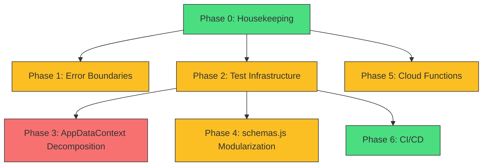

# Audit Remediation Plan — AutoBOM Pro / Engineering Management Platform

> **Version:** 1.0  
> **Created:** 2026-03-14  
> **Branch:** audit-remediation-plan (conceptual)  
> **Author:** Staff Engineering — Stability & Hardening  
> **Status:** 📋 Baseline Approved — Awaiting Phase 0 Execution

---

## 1. Executive Summary

### Current State Assessment

AutoBOM Pro has evolved from a BOM management tool into a full Engineering Management Platform across 11 development phases. The application is **functional and deployed** but carries significant technical debt from rapid iterative development.

#### What Exists (120+ source files)

| Layer | Count | Notes |
|-------|-------|-------|
| Pages | 21 | All route-level components operational |
| Component directories | 14 | ~50 component files total |
| Services | 8 | Firestore CRUD abstractions |
| Hooks | 5 | Custom data hooks |
| Utilities | 5 | Includes migration util, planner utils |
| Contexts | 3 | `AuthContext`, `RoleContext`, `AppDataContext` |
| Core (MI layer) | 21 files | ai/, analytics/, audit/, rules/, workflow/ |
| Models | 1 | `schemas.js` (33KB — monolithic) |
| Cloud Functions | 5 exports | `testGeminiConnection`, `analyzeQuotePdf`, `searchImages`, `generateInsights`, `scheduledAudit` |
| Firestore rules | 273 lines | Covers all collections |
| Tests | **1 file** | `insightGenerator.test.js` (46 lines) |

#### Key Metrics

- **`AppDataContext.jsx`**: 672 lines / 29KB — god-context holding all Firestore subscriptions + handlers
- **`models/schemas.js`**: 33KB — single monolithic schema definition
- **`architecture.md`**: **Severely outdated** — still documents pre-Phase 3 structure
- **`blueprint.md`**: Header says "Phase 11 Complete" but roadmap only documents Phases 1–10
- **Root artifacts**: `diagnostico_gemini.cjs`, `diagnostico_gemini_2.cjs`, `test_parser.js`, `build_output.txt`, `vite_log.txt`, `nodejs.msi`, `node_bin/`, `node22_bin/` — debris from debugging sessions
- **Test coverage**: ~0.8% (1 test file / 120+ source files)

---

## 2. Critical Risks

### 🔴 P0 — Immediate Risks

| # | Risk | Impact | Likelihood |
|---|------|--------|------------|
| R1 | **Near-zero test coverage** — any change can introduce silent regressions | High | Certain |
| R2 | **`AppDataContext` god-context** — 672 lines with all Firestore subscriptions; single point of failure; any change risks breaking multiple pages | High | High |
| R3 | **`architecture.md` severely outdated** — new developers/AI will make incorrect assumptions about file structure | Medium | Certain |
| R4 | **No error boundaries** — unhandled exception in any component crashes entire app | High | High |

### 🟡 P1 — High Risks

| # | Risk | Impact | Likelihood |
|---|------|--------|------------|
| R5 | **Blueprint documentation gap** — MI layer (Phases 11+) undocumented in roadmap section | Medium | Certain |
| R6 | **No CI/CD pipeline** — no automated build verification, no deploy gates | Medium | High |
| R7 | **No environment variable management** — Firebase config in source, function secrets via `defineSecret` only | Medium | Medium |
| R8 | **Monolithic `schemas.js`** (33KB) — hard to review, easy to break on schema changes | Medium | Medium |

### 🟢 P2 — Recommended Improvements

| # | Risk | Impact | Likelihood |
|---|------|--------|------------|
| R9 | Root directory debris (diagnostic scripts, MSI files, log files) — confusing and unprofessional | Low | Certain |
| R10 | Cloud Functions in single `index.js` (558 lines) — maintainability concern | Low | Medium |
| R11 | No Firestore emulator usage documented — all dev testing against production? | Medium | Unknown |

---

## 3. Remediation Phases

### Phase 0 — Housekeeping & Documentation Consistency
> **Effort:** 1–2 days | **Risk:** None | **Dependency:** None

**Scope:**
1. Remove root debris files (`diagnostico_gemini*.cjs`, `test_parser.js`, `build_output.txt`, `vite_log.txt`, `nodejs.msi`, `node_bin/`, `node22_bin/`)
2. Update `.gitignore` to prevent future debris accumulation (add `*.msi`, `*_log.txt`, `*_output.txt`, `node_bin/`, `node22_bin/`)
3. **Rewrite `architecture.md`** to reflect actual current structure (21 pages, 14 component dirs, core/ layer, services/, hooks/, etc.)
4. Update `blueprint.md` roadmap to include Phase 11 (MI Layer) documentation
5. Add proper `README.md` with setup instructions, architecture overview, and development workflow

**Definition of Done:**
- [ ] No debris files in root directory
- [ ] `architecture.md` accurately reflects current file tree
- [ ] `blueprint.md` roadmap covers all implemented phases (1–11)
- [ ] `README.md` contains setup, build, and deploy instructions
- [ ] `.gitignore` covers known debris patterns

**Regression Risk:** ⚪ None — documentation only + file removal

---

### Phase 1 — Error Boundaries & Resilience
> **Effort:** 1–2 days | **Risk:** Low | **Dependency:** Phase 0

**Scope:**
1. Add React Error Boundaries around major route groups (BOM, Engineering, MI, Admin)
2. Add fallback UI for crashed components (instead of white screen)
3. Add global unhandled promise rejection handler
4. Add Firestore connection health check in `AppDataContext`

**Definition of Done:**
- [ ] Error boundary wraps each major route group
- [ ] Component crash renders fallback UI, NOT white screen
- [ ] Console errors logged with component stack trace
- [ ] Application recovers gracefully from transient Firestore errors

**Regression Risk:** 🟡 Low — wrapping existing components; no logic changes

---

### Phase 2 — Test Infrastructure & Critical Path Coverage
> **Effort:** 3–5 days | **Risk:** Low | **Dependency:** Phase 0

**Scope:**
1. Configure Vitest properly in `vite.config.js` (add test config block)
2. Add `@testing-library/react` + `@testing-library/jest-dom` as dev dependencies
3. Create test utilities (mock Firebase, mock contexts)
4. Write unit tests for critical pure-logic modules:
   - `src/core/rules/ruleEvaluator.js`
   - `src/core/rules/taskRules.js`
   - `src/core/audit/auditEngine.js`
   - `src/core/audit/complianceScorer.js`
   - `src/core/analytics/snapshotBuilder.js`
   - `src/core/workflow/transitionValidator.js`
   - `src/utils/normalizers.js`
5. Write integration tests for services:
   - `src/services/taskService.js`
   - `src/services/timeService.js`
6. Add `npm run test:unit` and `npm run test:integration` scripts

**Definition of Done:**
- [ ] Vitest runs successfully with `npm test`
- [ ] At least 70% line coverage on `src/core/` modules
- [ ] At least 1 integration test per service that validates Firestore interactions (mocked)
- [ ] Test utilities documented and reusable
- [ ] All existing tests pass

**Regression Risk:** 🟡 Low — test-only changes; no production code modified

---

### Phase 3 — `AppDataContext` Decomposition
> **Effort:** 3–5 days | **Risk:** Medium | **Dependency:** Phase 2 (tests must exist first)

**Scope:**
1. Extract BOM-specific Firestore subscriptions and handlers into `BomDataContext`
2. Extract engineering task/project subscriptions into `EngineeringDataContext`
3. Extract managed lists (brands/categories/providers) into `ManagedListsContext`
4. Keep `AppDataContext` as a thin orchestrator that composes sub-contexts
5. Verify all 21 pages still render and function correctly after decomposition

**Definition of Done:**
- [ ] `AppDataContext` reduced to < 150 lines
- [ ] Each sub-context is independently testable
- [ ] All existing pages render without errors
- [ ] No new console warnings
- [ ] All Phase 2 tests still pass

**Regression Risk:** 🔴 Medium-High — this is a structural change; must be done carefully with tests as safety net

---

### Phase 4 — `schemas.js` Modularization
> **Effort:** 1–2 days | **Risk:** Low | **Dependency:** Phase 2

**Scope:**
1. Split `models/schemas.js` (33KB) into domain-specific schema files:
   - `models/bom.schemas.js`
   - `models/engineering.schemas.js`
   - `models/mi.schemas.js` (Management Intelligence)
   - `models/index.js` (re-exports)
2. Update all imports across the codebase

**Definition of Done:**
- [ ] No individual schema file exceeds 10KB
- [ ] All imports resolve correctly
- [ ] Build passes without errors
- [ ] All Phase 2 tests pass

**Regression Risk:** 🟡 Low — import path changes only; structure preserved

---

### Phase 5 — Cloud Functions Modularization & Testing
> **Effort:** 2–3 days | **Risk:** Low-Medium | **Dependency:** Phase 0

**Scope:**
1. Split `functions/index.js` (558 lines) into domain-specific modules:
   - `functions/ai/analyzeQuotePdf.js`
   - `functions/ai/generateInsights.js`
   - `functions/search/searchImages.js`
   - `functions/scheduled/dailyAudit.js`
   - `functions/index.js` (thin re-export)
2. Add unit tests for Cloud Functions logic
3. Document local testing with Firebase emulator

**Definition of Done:**
- [ ] Each function in its own module file
- [ ] `functions/index.js` is < 30 lines (re-exports only)
- [ ] Functions deploy successfully
- [ ] At least 1 unit test per function module
- [ ] Emulator setup documented

**Regression Risk:** 🟡 Low-Medium — must verify deploy works after restructuring

---

### Phase 6 — CI/CD & Build Verification
> **Effort:** 2–3 days | **Risk:** Low | **Dependency:** Phase 2

**Scope:**
1. Add GitHub Actions workflow for:
   - Lint (`eslint`)
   - Unit tests (`vitest`)
   - Build verification (`vite build`)
2. Add pre-commit hooks (optional: `husky` + `lint-staged`)
3. Document deployment process in `README.md`

**Definition of Done:**
- [ ] PR builds trigger lint + test + build
- [ ] Failed checks block merge (branch protection rule documented)
- [ ] Deploy process documented step-by-step
- [ ] Badge in `README.md` showing CI status

**Regression Risk:** ⚪ None — infrastructure only

---

## 4. Phase Dependencies

**Critical Path:** Phase 0 → Phase 2 → Phase 3

Phases 1, 4, 5, and 6 can be parallelized once their dependencies are met.

---

## 5. Regression Risk Matrix

| Phase | Risk Level | Mitigation |
|-------|-----------|------------|
| Phase 0 | ⚪ None | Documentation only |
| Phase 1 | 🟡 Low | Component wrapping, no logic changes |
| Phase 2 | 🟡 Low | Test-only, no production code |
| Phase 3 | 🔴 Medium-High | Tests MUST exist before starting; incremental extraction with page-by-page verification |
| Phase 4 | 🟡 Low | Import path refactor only; automated codemod possible |
| Phase 5 | 🟡 Low-Medium | Deploy verification mandatory |
| Phase 6 | ⚪ None | Infrastructure only |

---

## 6. Modules — DO NOT TOUCH

> ⚠️ **The following modules MUST NOT be modified during remediation unless explicitly required for shared infrastructure changes.**

| Module | Files | Reason |
|--------|-------|--------|
| **BOM Core** | `BomProjects.jsx`, `BomProjectDetail.jsx`, `Catalog.jsx` | Stable production feature; no open bugs |
| **BOM Components** | `components/catalog/*`, `components/projects/*` | Tightly coupled to BOM pages; stable |
| **AI Import** | `handlePdfUpload`, `handleExcelUpload` in `AppDataContext` | Complex async flows; proven in production |
| **Image Search** | `ImagePickerModal.jsx`, `searchImages` Cloud Function | External API integration; stable |
| **Login/Auth** | `LoginPage.jsx`, `AuthContext.jsx` | Security-critical; no changes needed |
| **Firestore Rules** | `firestore.rules` | Security-critical; audit separately if needed |
| **Cloud Function: `analyzeQuotePdf`** | `functions/index.js` (lines 60–138) | Production AI pipeline; do not refactor logic |

### Minimal Exception Criteria

A module on this list may be touched ONLY if:
1. A **shared infrastructure change** (e.g., context decomposition) requires updating an import path
2. A **regression** is detected and traced to that module
3. The change is **purely mechanical** (import path update, no logic change)

All such changes require explicit documentation in the PR description.

---

## 7. Success Criteria

After all 6 remediation phases are complete:

| Criteria | Target |
|----------|--------|
| Test coverage on `src/core/` | ≥ 70% line coverage |
| Unit tests | ≥ 30 test cases |
| `AppDataContext` size | < 150 lines |
| Architecture docs accuracy | 100% — reflects actual structure |
| Error boundaries | All major route groups covered |
| CI pipeline | Lint + Test + Build on every PR |
| Root debris | Zero non-essential files |

---

## 8. Estimated Timeline

| Phase | Duration | Can Parallelize |
|-------|----------|----------------|
| Phase 0 | 1–2 days | — |
| Phase 1 | 1–2 days | After Phase 0 |
| Phase 2 | 3–5 days | After Phase 0 |
| Phase 3 | 3–5 days | After Phase 2 |
| Phase 4 | 1–2 days | After Phase 2 |
| Phase 5 | 2–3 days | After Phase 0 |
| Phase 6 | 2–3 days | After Phase 2 |
| **Total** | **~13–22 days** | With parallelization: **~10–15 days** |
